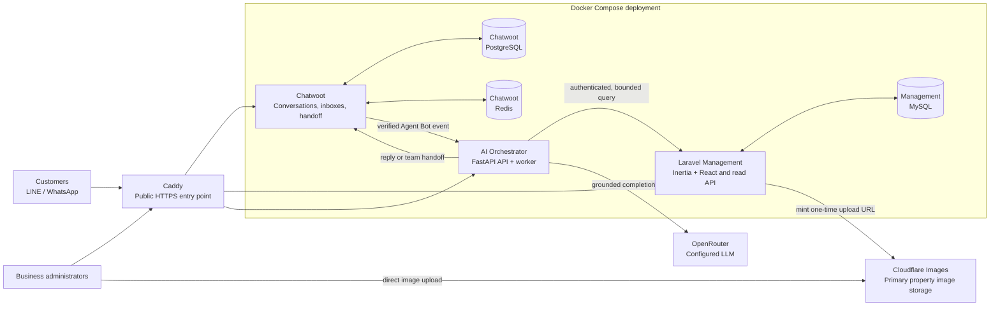

# AI Bot Chatwoot

Development and releases follow [`dev` → `stg` → `main`](docs/BRANCHING.md).

> A single-business omnichannel AI assistant for LINE and WhatsApp, with Chatwoot
> as the conversation workspace and Laravel Management as the business-knowledge source of truth.

## Overview

AI Bot Chatwoot helps a business answer customer questions using current, structured business
data rather than a static prompt. Customers message the business through Chatwoot-connected
channels; the AI retrieves only the relevant catalog or knowledge records, prepares a grounded
reply, and hands the conversation to a shared Chatwoot team whenever human judgement is needed.

Version 1 is deliberately focused on one business. The included reference data models a real
estate business, so the AI can answer questions such as available land by area, condos by budget,
or property details. The core data model remains domain-neutral: another business can define its
own catalog categories and attributes without changing the orchestration layer.

| Area | Responsibility |
| --- | --- |
| Conversation workspace | Chatwoot owns inboxes, message history, conversation state, and human assignment. |
| Business data | Laravel Management and MySQL own catalog records, knowledge, FAQs, prices, and availability. |
| AI orchestration | The FastAPI service verifies events, checks ownership, retrieves bounded data, and performs handoff. |
| LLM provider | OpenRouter, configured with `deepseek/deepseek-v4-flash-0731`. |

## Highlights

- Supports LINE and WhatsApp through Chatwoot; there is no competing direct LINE webhook.
- Provides a Laravel + Inertia/React internal Management workspace for business knowledge and catalog data.
- Searches structured catalog records through an authenticated Management API; the AI never has database credentials.
- Grounds replies in bounded API results and does not invent availability, pricing, promotions, or policies.
- Presents the current business as a lean real-estate workflow while keeping catalog storage and APIs domain-neutral.
- Builds LINE property carousels from the exact ordered IDs returned by catalog search and rechecks eligibility before rendering.
- Asks for customer consent before relaxing a zero-result property search; location, price, and property attributes may be removed, but category and sale/rent intent remain.
- Supports one validated HTTPS primary image per property, including admin direct upload to Cloudflare Images, and a structured 23-column property import while retaining the legacy 9-column import contract.
- Routes human handoff to a configured Chatwoot team, never to a hard-coded individual.
- Uses explicit return-to-AI actions and fails closed if conversation ownership cannot be confirmed.
- Deploys as one Docker Compose stack on the configured GCP VM environment.

## High-Level Architecture



The detailed runtime, message lifecycle, ownership boundaries, and deployment topology are in
[docs/ARCHITECTURE.md](docs/ARCHITECTURE.md).

## Conversation and Data Flow

1. A customer message arrives in a LINE or WhatsApp inbox managed by Chatwoot.
2. Chatwoot records the conversation, then sends an Agent Bot event to the internal AI service.
3. The AI service verifies the event, deduplicates it, and reads the current Chatwoot ownership state.
4. For an eligible conversation, it requests only the relevant FAQ, knowledge, or catalog records
   from the authenticated Management API.
5. If a property search returns no exact result, the service asks permission before retrying with
   only location, price, and property-attribute filters removed. A second empty result uses a fixed
   no-result response and does not ask the LLM to invent alternatives.
6. For LINE catalog results, the service asks Management to render the exact ordered result IDs as
   a Flex carousel; Management independently removes records that are no longer eligible.
7. The configured LLM produces a response from bounded data. Before sending, the AI checks
   ownership again so it never races a human agent.
8. A request for a person, complaint, payment problem, or an unsafe/unknown answer moves
   the conversation to the configured Chatwoot handoff team.

## Version 1 Scope

| Included | Intentionally excluded |
| --- | --- |
| One business, LINE and WhatsApp through Chatwoot | Multi-tenant SaaS, billing, and tenant provisioning |
| Catalog, knowledge, FAQs, promotions, and availability | Booking, appointments, calendar integration, and reservations |
| Grounded AI answers and catalog search | Payment collection, payment links, refunds, and financial execution |
| Team-based human handoff | Direct SQL or database access from the AI/LLM |
| Real-estate reference data | Vector database or autonomous catalog editing |

The full product contract, acceptance criteria, and delivery gates are maintained in
[SPEC.md](SPEC.md).

## Repository Guide

```text
apps/management/       Laravel 13 Management app and authenticated Catalog/Knowledge/Flex APIs
services/ai/           FastAPI webhook, AI orchestration, and worker
infra/chatwoot/        Chatwoot bootstrap and container-specific guidance
infra/caddy/           HTTPS reverse-proxy configuration
infra/deploy/          VM environment bootstrap script
docs/                  Architecture and implementation documentation
compose.yml            Full local/VM Docker Compose stack
SPEC.md                Version 1 product and technical contract
AGENTS.md              Engineering rules and architecture boundaries
```

## Quick Start: Docker Compose on a VM

### Prerequisites

- Docker Engine with Docker Compose plugin
- Three DNS names that resolve to the VM: Chatwoot, Management, and AI
- An OpenRouter API key supplied outside source control
- A Cloudflare Images account and an API token with Images Edit permission when enabling property-image uploads
- LINE or WhatsApp credentials when activating a real channel

### 1. Create deployment configuration

From the repository root, define the three public hostnames and let the VM bootstrap script
create a local `.env` with generated deployment secrets:

```bash
export CHATWOOT_HOSTNAME=chat.example.com
export MANAGEMENT_HOSTNAME=management.example.com
export AI_HOSTNAME=ai.example.com
./infra/deploy/bootstrap-vm.sh
```

The generated `.env` is local to the VM and must not be committed. `.env.example` is a key map,
not a complete production configuration.

### 2. Supply the model key at runtime

Create `runtime/openrouter.env` on the VM from the approved secret-management flow. It must contain
`OPENROUTER_API_KEY` and be readable only by the deployment user (mode `600`). Keep this file out
of Git and do not place its contents in logs, issue reports, or documentation.

### 3. Start and inspect the stack

```bash
docker compose up -d
docker compose ps
docker compose logs --tail=50 chatwoot-bootstrap
```

The stack starts Caddy, Chatwoot Rails and Sidekiq, Chatwoot PostgreSQL and Redis, Laravel
Management and MySQL, plus the AI API and worker. `chatwoot-bootstrap` is idempotent: it prepares
the Chatwoot account, handoff team, Agent Bot, and service credentials without printing secrets.

## Channel Activation

### LINE

1. Set `LINE_CHANNEL_ID`, `LINE_CHANNEL_SECRET`, and `LINE_CHANNEL_ACCESS_TOKEN` in the VM runtime environment.
2. Run the bootstrap service again:

   ```bash
   docker compose up -d chatwoot-bootstrap ai ai-worker
   ```

3. In LINE Developers, configure the callback URL provided by the Chatwoot LINE inbox and enable webhooks.
4. Send a non-production test message and confirm that it appears in Chatwoot before enabling AI replies.

### WhatsApp

Create the WhatsApp inbox in Chatwoot using the selected provider's credentials, then attach the
same Agent Bot and confirm it is an allowed inbox for the AI service. This keeps Chatwoot as the
only channel/conversation path for both integrations.

## Runtime Configuration

| Variable or file | Purpose | Handling |
| --- | --- | --- |
| `CHATWOOT_HOSTNAME`, `MANAGEMENT_HOSTNAME`, `AI_HOSTNAME` | Public HTTPS hostnames used by Caddy | VM `.env` |
| `OPENROUTER_API_KEY` | OpenRouter authentication | `runtime/openrouter.env`; never commit |
| `OPENROUTER_MODEL` | Selected LLM model | Defaults to `deepseek/deepseek-v4-flash-0731` |
| `MANAGEMENT_TIMEOUT_SECONDS`, `CHATWOOT_TIMEOUT_SECONDS`, `OPENROUTER_TIMEOUT_SECONDS`, `PROCESSING_TIMEOUT_SECONDS` | Bounded upstream and end-to-end processing timeouts | VM `.env`; defaults 5/8/15/25 |
| `AI_CONTEXT_TTL_SECONDS` | Lifetime of catalog follow-up context in Chatwoot custom attributes | VM `.env`; default 86400 |
| `AI_SERVICE_TOKEN` | Read-only Management API access for the AI service | VM `.env` / secret flow |
| `CHATWOOT_WEBHOOK_TOKEN` | Protects the Chatwoot-to-AI webhook path | VM `.env`; generated by bootstrap |
| `LINE_CHANNEL_ID`, `LINE_CHANNEL_SECRET`, `LINE_CHANNEL_ACCESS_TOKEN` | Enables the Chatwoot LINE inbox and direct Flex push from the AI worker | VM runtime environment; never commit |
| `CLOUDFLARE_IMAGES_ACCOUNT_ID`, `CLOUDFLARE_IMAGES_API_TOKEN` | Mints one-time primary-image upload URLs | Management runtime environment; token never reaches the browser |
| `CLOUDFLARE_IMAGES_DELIVERY_BASE_URL`, `CLOUDFLARE_IMAGES_VARIANT` | Builds the public HTTPS URL stored with a property | Management runtime environment |

See [.env.example](.env.example) and [services/ai/.env.example](services/ai/.env.example) for
placeholder names only. Do not copy real credentials into either file.

## Local Application Development

Use the root Compose stack for an integrated environment. For focused development, each component
has its own setup guide:

| Component | Guide | Common checks |
| --- | --- | --- |
| Management | [apps/management/README.md](apps/management/README.md) | `php artisan test`, `npm run typecheck`, `npm run lint`, `npm run build` |
| AI service | [services/ai/README.md](services/ai/README.md) | `pytest`, `python3 -m compileall -q src tests` |
| Chatwoot container | [infra/chatwoot/README.md](infra/chatwoot/README.md) | `docker compose config` |

## Safety and Ownership Rules

- Chatwoot is the system of record for conversations, inboxes, assignment, and AI/human state.
- Management/MySQL is the system of record for business facts; Chatwoot is not used as a catalog database.
- The AI calls Management through authenticated HTTP APIs only. It never connects to MySQL directly
  and never generates SQL.
- AI replies require a live ownership check both before model work and immediately before sending.
- On handoff, the AI locks the conversation first and assigns a shared Chatwoot team. A human agent
  can return a conversation to AI only through an explicit action.
- Customer messages, PII, prompts, raw model output, private notes, and secrets must not be written
  to application logs.

## Documentation

| Document | Description |
| --- | --- |
| [SPEC.md](SPEC.md) | Approved Version 1 scope, requirements, acceptance criteria, and production-readiness gate |
| [docs/ARCHITECTURE.md](docs/ARCHITECTURE.md) | Detailed runtime architecture, lifecycle, security boundaries, and deployment topology |
| [docs/LINE_RICH_MENU_FLEX_SETUP.md](docs/LINE_RICH_MENU_FLEX_SETUP.md) | Environment-neutral LINE Rich Menu and Flex API integration guide |
| [apps/management/docs/IMPORT_FORMAT.md](apps/management/docs/IMPORT_FORMAT.md) | Current 23-column property import and backward-compatible 9-column format |
| [AGENTS.md](AGENTS.md) | Engineering workflow, ownership rules, and security constraints |
| [PRODUCT.md](PRODUCT.md) | Management product intent and UX principles |
| [DESIGN.md](DESIGN.md) | Management design-system direction and accessibility requirements |

## Current Status

The repository contains the Version 1 implementation and Docker Compose deployment bundle. The
base stack and lean real-estate slice are deployed to the configured GCP VM; Management/AI health,
the property-image migration, upload route/assets, and internal Catalog API path are verified.
Cloudflare Images runtime credentials and live image-upload/channel end-to-end verification remain
deployment inputs. Production activation still requires the readiness checks in [SPEC.md](SPEC.md),
and no credentials belong in this repository.
