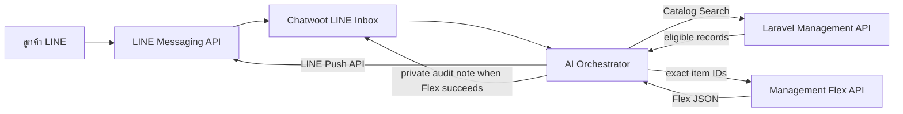

# คู่มือ LINE Rich Menu และ Flex Message สำหรับ Property Profile

เอกสารนี้อธิบาย contract ปัจจุบันของ LINE Rich Menu และ LINE Flex Message โดยไม่ผูกกับ
Rich Menu ID, Inbox ID, Channel ID, hostname หรือ production account ใด ค่าจริงทั้งหมดต้องมาจาก
runtime configuration/secret manager และต้องตรวจใน environment เป้าหมายก่อนใช้งาน

`SPEC.md` และ `docs/architecture/overview.md` เป็น source of truth หากตัวอย่างในเอกสารนี้ขัดกับสองไฟล์นั้น
ให้ยึดเอกสาร canonical และ source/tests ปัจจุบัน

## 1. เส้นทางข้อความ



- Chatwoot เป็น channel/conversation owner และเป็น webhook หลักของ LINE
- AI เรียก Management ผ่าน authenticated HTTP APIs เท่านั้น ไม่เข้าฐานข้อมูลโดยตรง
- เมื่อ Flex push สำเร็จ AI บันทึกข้อความประกอบเป็น private note ใน Chatwoot เพื่อไม่ส่งข้อความซ้ำให้ลูกค้า
- WhatsApp ใช้ข้อความผ่าน Chatwoot; LINE Flex เป็น presentation enhancement เฉพาะช่องทาง LINE

## 2. แนวทาง Rich Menu

Rich Menu ควรส่ง action แบบข้อความธรรมดาเข้าบทสนทนา เช่น:

| Action | ข้อความตัวอย่าง |
|---|---|
| ค้นหาคอนโด | `สนใจคอนโดสำหรับซื้อ มีโครงการไหนบ้าง` |
| ค้นหาบ้าน | `สนใจบ้านสำหรับเช่า` |
| ฝากขาย/ฝากเช่า | `ต้องการข้อมูลบริการฝากขายหรือฝากเช่า` |
| สินเชื่อ | `ขอข้อมูลบริการปรึกษาสินเชื่อบ้าน` |
| ข้อมูลธุรกิจ | `เปิดกี่โมงและติดต่อได้ทางไหน` |
| ติดต่อเจ้าหน้าที่ | `ขอคุยกับเจ้าหน้าที่` |

ข้อควรระวัง:

- ห้าม commit access token, Rich Menu ID, Channel ID, Inbox ID หรือ callback URL จริง
- Rich Menu ไม่ควรสื่อว่าระบบจองเวลา รับชำระเงิน หรืออนุมัติสินเชื่อโดยอัตโนมัติ
- ปุ่มที่เกี่ยวกับการนัดชมเป็นเพียงข้อความขอส่งต่อเจ้าหน้าที่ Version 1 ไม่มี calendar/booking execution
- ต้องทดสอบ action ทุกปุ่มใน non-production inbox ก่อนเปิดเป็น default Rich Menu

## 3. Management Flex API

ทุก endpoint ใช้ bearer token ที่มีสิทธิ์ read และถูก rate limit

### 3.1 Property Bubble

```http
GET /api/v1/flex/catalog/{item_id}
Authorization: Bearer <READ_TOKEN>
```

คืน Flex bubble เฉพาะรายการที่ active, published, อยู่ในช่วงวันที่มีผล และ
`availability = available` ถ้ารายการไม่ผ่านเงื่อนไขจะคืน `404` ข้อมูลที่แสดงมาจาก
structured catalog record เท่านั้น และไม่มีการสร้างคุณสมบัติทรัพย์ที่ไม่มีในข้อมูล

### 3.2 Exact Result Carousel — เส้นทางที่ AI ใช้

```http
POST /api/v1/flex/carousel
Authorization: Bearer <READ_TOKEN>
Content-Type: application/json

{
  "item_ids": [12, 7, 20]
}
```

กติกา:

- ต้องมี ID จำนวน 1–10 รายการ เป็นจำนวนเต็มบวกและห้ามซ้ำ
- ลำดับการ์ดตรงกับลำดับ `item_ids`
- Management ตรวจ active, published, effective และ available ซ้ำในเวลาสร้างการ์ด
- ID ที่ไม่ผ่านเงื่อนไขจะถูกตัดออก โดยไม่แทนที่ด้วยรายการล่าสุดหรือรายการใน category เดียวกัน
- ถ้าไม่เหลือรายการที่มีสิทธิ์จะแจ้ง `404`

AI ต้องส่ง ID จากผล `POST /api/v1/catalog/search` ชุดเดียวกับข้อความตอบ ห้ามใช้ category-wide
carousel แทนผลค้นหา เพราะจะทำให้ข้อความและการ์ดอ้างอิงคนละ inventory

### 3.3 Compatibility Carousel

```http
GET /api/v1/flex/carousel?category_slug=condo&limit=5
Authorization: Bearer <READ_TOKEN>
```

route นี้คืนรายการล่าสุดตาม category เพื่อความเข้ากันได้/การใช้งานแบบ manual discovery เท่านั้น
AI search flow ปัจจุบันไม่ใช้ route นี้สร้างคำตอบจากคำถามที่มีเงื่อนไข

### 3.4 Service Cards

```text
GET /api/v1/flex/loan
GET /api/v1/flex/consignment
GET /api/v1/flex/about
```

เป็นการ์ดข้อมูลบริการคงที่จาก Management ไม่ใช่ catalog search และไม่เพิ่ม booking/payment workflow

## 4. รูปหลักของทรัพย์

รายการทรัพย์มี `primary_image_url` ได้หนึ่งค่า:

- ต้องเป็น URL แบบ HTTPS และยาวไม่เกิน 2048 ตัวอักษร
- ผู้ดูแลอัปโหลด JPEG, PNG หรือ WebP ขนาดไม่เกิน 10 MB จากฟอร์มได้ ระบบจะขอ one-time URL
  จาก Cloudflare Images แล้วอัปโหลดตรงจาก browser โดยไม่เปิดเผย API token
- Catalog Search/detail และ import/export ส่งต่อฟิลด์นี้
- ถ้ามีค่า Flex bubble จะใช้เป็น `hero` image อัตราส่วน `20:13` แบบ `cover`
- ถ้าไม่มีค่า Flex จะตัด `hero` ออก ไม่ใช้รูปสมมติ
- Version 1 เก็บ delivery URL หนึ่งค่า ไม่มี gallery และยังไม่ลบรูปบน Cloudflare อัตโนมัติเมื่อ
  เปลี่ยนรูป ลบรายการ หรือออกจากฟอร์มโดยไม่บันทึก

ตัวอย่างส่วน `hero`:

```json
{
  "hero": {
    "type": "image",
    "url": "https://cdn.example.com/properties/listing-001.jpg",
    "size": "full",
    "aspectRatio": "20:13",
    "aspectMode": "cover"
  }
}
```

## 5. Zero-result และการผ่อนเงื่อนไข

เมื่อ Catalog Search ไม่พบรายการ exact:

1. AI แจ้งว่าไม่พบและถามว่าต้องการดูตัวเลือกอื่นหรือไม่
2. ยังไม่เรียก broad search จนกว่าลูกค้าจะให้ consent ที่ตรวจได้
3. หลัง consent AI อาจตัดทำเล ราคา และ category attributes ออก
4. ต้องคง `category_slug` และ `transaction_type` เดิม
5. ถ้ายังไม่พบ AI ใช้ข้อความ no-result แบบกำหนดตายตัวและเสนอส่งต่อเจ้าหน้าที่ โดยไม่เรียก LLM

## 6. Inbox และ human handoff

- ปิด auto-assignment สำหรับ inbox กลางที่ AI ดูแล เพื่อไม่ให้การ assign มนุษย์เกิดโดยไม่ตั้งใจ
- ก่อนตอบและก่อนส่งข้อความ AI ต้องตรวจ ownership สดจาก Chatwoot
- เมื่อ handoff ระบบ lock AI ก่อน แล้ว assign ไปยัง team ที่กำหนดผ่าน configuration
- การกลับมาใช้ AI ต้องเป็น explicit action เช่น workflow/label ที่กำหนด ห้ามกลับอัตโนมัติจากข้อความลูกค้าใหม่
- Inbox/team IDs เป็น runtime configuration ห้ามเขียนเลขคงที่ในเอกสารหรือ business logic

## 7. Verification checklist

- `POST /api/v1/catalog/search` คืนเฉพาะรายการ eligible และมี ID แบบ bounded
- `POST /api/v1/flex/carousel` รักษาลำดับ ID และตัดรายการ ineligible
- HTTP image URL ถูกปฏิเสธ; HTTPS image แสดงเป็น hero
- รายการไม่มีรูปหรือ spec ไม่ทำให้ Flex สร้างข้อเท็จจริงขึ้นเอง
- zero-result ไม่ค้นกว้างก่อน consent และ empty relaxed result ไม่เรียก LLM
- Flex ที่ลูกค้าได้รับตรงกับ private note/ข้อความ grounded ชุดเดียวกัน
- human assignment ระหว่างประมวลผลทำให้ AI fail closed และไม่ส่งข้อความแข่งกับเจ้าหน้าที่
